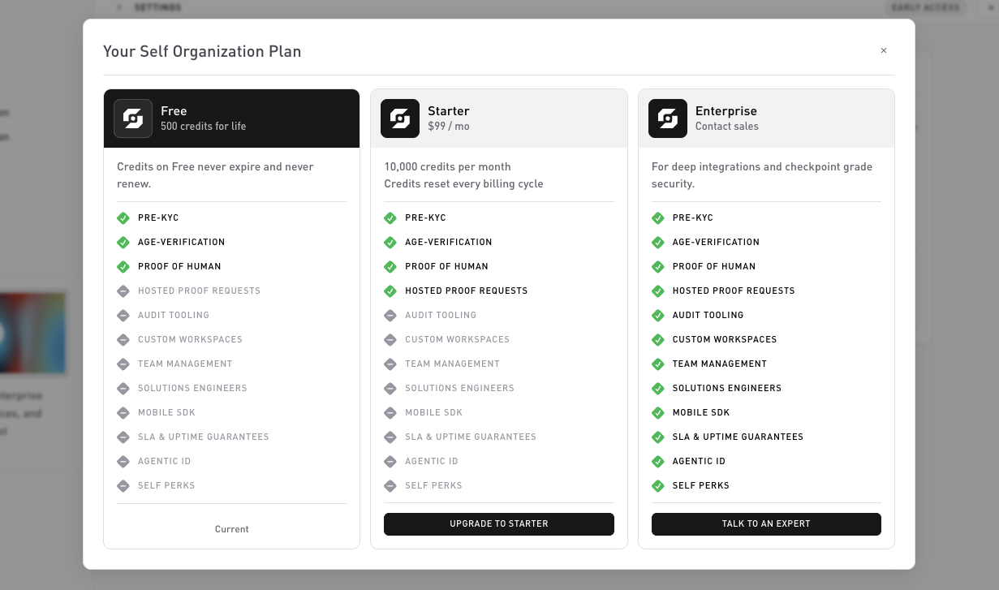

# Plans

Three tiers. Manage yours on the **Settings → Usage & Billing** tab via **Manage plan**. Concrete prices and credit amounts are shown there; the shape below is what each tier unlocks.

## Free

The default plan, for evaluation and small projects.

* **Credits**: a one-time signup grant that **never expires and never renews**.
* **Products**: Pre KYC, Age Verification, Proof of Human.
* Test and live environments, plus webhooks.

## Starter

The self-serve paid tier, subscribe from **Manage plan**.

* **Billing**: a fixed fee, billed **monthly or annually** (you choose at checkout).
* **Credits**: a monthly allotment that **resets each billing cycle**.
* **Everything in Free**, plus **Hosted Proof Requests**.

## Enterprise

For volume and regulated environments. Arranged with sales, there's no self-serve checkout.

* **Credits**: custom grants.
* **Everything in Starter**, plus Audit Tooling, Custom Workspaces, Team Management, Solutions Engineers, Mobile SDK, SLA and uptime guarantees, Agentic ID, and Self Perks.

Contact sales@self.xyz to start.

## Switching plans

From **Settings → Usage & Billing**:

* **Manage plan**: upgrade or change tier. Upgrades take effect immediately and are prorated for the rest of the cycle.
* **Update billing**: opens the Stripe customer portal to change your payment method or cancel.

## What you don't pay for

* Test-environment verifications, test traffic doesn't bill.
* Webhook deliveries, bundled into the per-verification cost.
* Sessions that end `expired` or `error`, only completed verifications are billed. See [Credits and usage](credits-and-usage.md).

## Related

* [Credits and usage](credits-and-usage.md): how the per-verification cost works.
* [Dashboard: Billing](../dashboard/billing.md).
