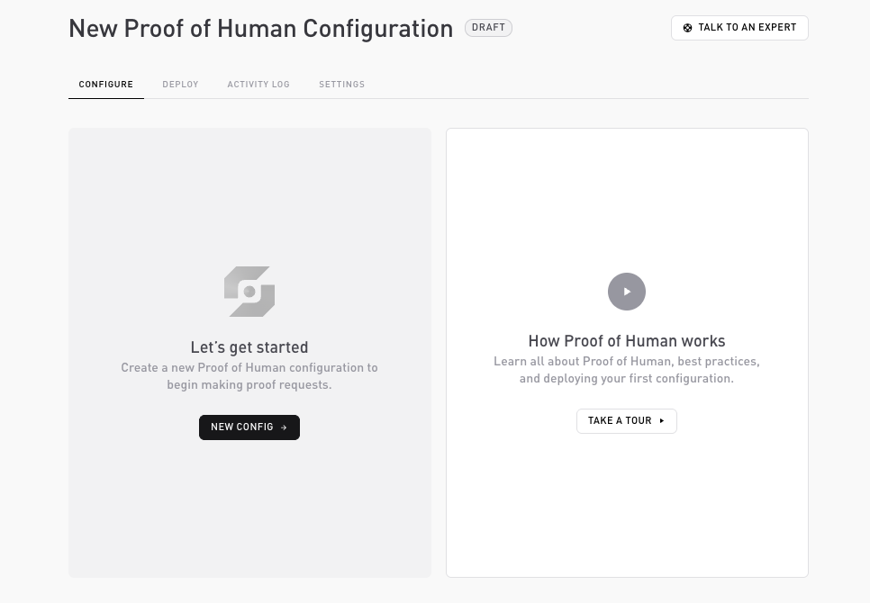
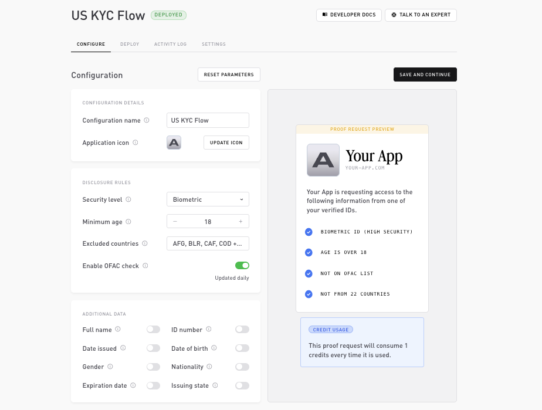

# Configure a product

A configuration always starts by choosing one of the three products. The product decides which rules you can set. You then build it in the **Configure** tab.

## Pick a product

| Product | What the user proves | Configurable rules |
| --- | --- | --- |
| **Pre KYC** | Holds a genuine document, optionally meets an age floor, comes from an allowed country, clears OFAC | Minimum age, excluded countries, OFAC |
| **Age Verification** | Meets an age threshold | Minimum age |
| **Proof of Human** | Is a unique, real human | None (uniqueness is intrinsic) |

## The Configure tab

The Configure tab has three cards on the left. On the right, a live **proof-request preview** shows what the user will see, and a **credit estimate** shows what each verification will cost.

### Configuration details

* **Configuration name**: a label for this config.
* **Application icon**: the icon shown on the proof request. Managed under **Settings → General**.

### Disclosure rules

The predicates the user must satisfy. The user proves each one without revealing the underlying value.

* **Security level**: **Standard** verifies the document is genuine; **Biometric** also verifies the user physically scanned the document's chip.
* **Minimum age** (Pre KYC, Age Verification): the age threshold. Only the pass or fail result is disclosed, never the date of birth.
* **Excluded countries** (Pre KYC): documents issued by a country on this list fail. Only the pass or fail result is disclosed, not the user's country. ISO 3166-1 alpha-3 codes.
* **OFAC check** (Pre KYC): match against the US Treasury OFAC sanctions list. Self keeps the list updated daily, and only the pass or fail result is disclosed.

### Additional data

Beyond the pass or fail rules, you can ask the user to disclose specific document fields. Each is an explicit reveal, **off by default**, request only what you need:

`Full name`, `ID number`, `Date issued`, `Date of birth`, `Gender`, `Nationality`, `Expiration date`, `Issuing state`.

## Save and publish

Saving stores your changes. To take the configuration live, publish it from the **Deploy** tab, where it gets a `flowId` and you generate [API keys](api-keys.md). The dashboard validates the configuration before you can publish.

A product keeps one active configuration at a time. Once published, a configuration is immutable, you can't edit it. To change anything, archive it and create a new one. In-flight sessions keep using the version they were created against, so archiving never breaks an open session.

## Related

* [Disclosures](../flows/disclosures.md): what each rule and reveal proves.
* [Supported documents](../flows/supported-documents.md): which documents work where.
* [API keys](api-keys.md): generate the keys your backend uses.
