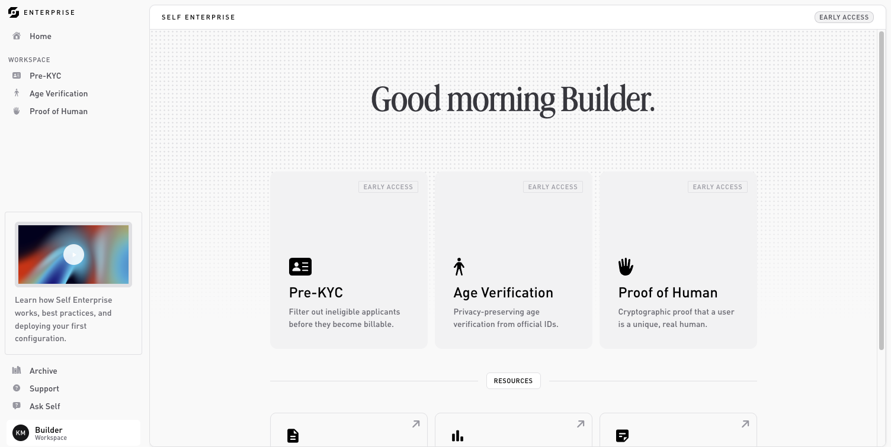

# Dashboard overview

The [dashboard](https://dashboard.self.xyz) is where you configure products, manage keys, watch traffic, and pay for what you use. This page is a map.

## Top-level sections

### Home

The landing surface. Shows recent activity across your products, quick links to common actions, and resource cards (docs, community, status).

### Products

Each product (Pre KYC, Age Verification, Proof of Human) has its own page and holds **one active configuration at a time**. The page splits into tabs:

* [Configure](configure-a-product.md): disclosure rules and (for Pre KYC) additional data.
* **Deploy**: publish the configuration and generate [API keys](api-keys.md).
* [Activity log](activity-log.md): verifications, errors over time.

To change a live configuration you archive it first, then create a new one.

### Archive

Where a product's previous configurations go once you replace them. Archived configurations have their proof requests **deactivated**, but their activity log stays viewable for audit.

### Settings

Org-wide configuration, organized into tabs:

* [**General**](#general): organization name, your profile, theme, and deactivation.
* [**Usage & Billing**](billing.md): plan, credit balance, and usage.
* [**Webhooks**](webhooks.md): endpoints, and signing secrets.
* **Audit**: an exportable record of changes.
* [**People**](people.md): members and invites.
* **System Status**: live service status.

(API keys aren't here, you generate them on a product's **Deploy** tab. See [API keys](api-keys.md).)

## Permissions

Members have one of three roles, `owner`, `admin`, or `member`, which control who can manage keys, webhooks, and billing. See [People → Roles](people.md#roles). For machine access, use [API keys](api-keys.md) rather than a member's login.
