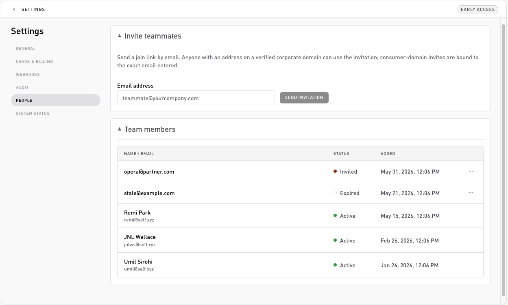

# People

**Settings → People**. Invite teammates and see who's on your organization. Inviting is limited to `owner` and `admin` roles.

## Invite a teammate

In the **Invite teammates** card, enter an email and click **Send invitation**. Self emails them a join link.

* Anyone with an address on a **verified corporate domain** can accept the invitation.
* A **consumer-domain** invite (for example a gmail.com address) is bound to the exact email you entered.

## Team members

The **Team members** card lists everyone on the org and every outstanding invite:

| Column | Notes |
| --- | --- |
| Name / Email | Stacked. Name fills in once the person accepts. |
| Status | **Active** (joined), **Invited** (pending), or **Expired**. |
| Added | When they were invited or joined. |

Pending and expired invitations have a **⋯** menu with **Resend** and **Revoke**.

## Roles

Every member has one of three roles:

| Role | Can do |
| --- | --- |
| **`owner`** | Everything, including billing actions (change plan, toggle the credit gate). |
| **`admin`** | Invite teammates, manage flows, generate and revoke API keys, manage webhooks. Not owner-only billing actions. |
| **`member`** | Read access: view flows, the activity log, usage, and webhook delivery history. |

Only `owner` and `admin` can invite teammates, manage API keys, and manage webhook endpoints. The billing credit-gate toggle is `owner`-only.

## Related

* [Dashboard overview](overview.md): where People sits among the Settings tabs.
* [API keys](api-keys.md): for machine access, use a key rather than a member login.
