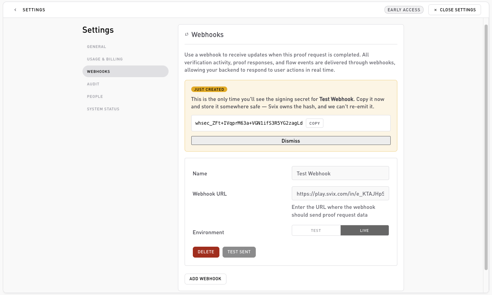

# Webhooks (dashboard)

**Settings → Webhooks**. Register the HTTPS endpoints Self posts events to. For the delivery model, signatures, retries, and payloads, see the [Webhooks section](../webhooks/overview.md).

## Add an endpoint

Click **Add endpoint** and fill in:

* **Name**: a label for the endpoint.
* **Webhook URL**: the public HTTPS URL that receives the POSTs.
* **Environment**: `test` or `live` (defaults to test).

On save:

* The **signing secret** (`whsec_...`) is revealed **once**. This is the only time you'll see it, copy it into your secret manager as `SELF_WEBHOOK_SECRET`.
* Self sends a **test event** to the URL right away (shown as "Test sent") so you can confirm it's reachable.

Every endpoint receives **all** event types (`verification.completed`, `verification.storage_committed`, `verification.storage_failed`); there's no per-endpoint event picker. Branch on `event.type` in your handler. See the [event catalog](../webhooks/events.md).

## Managing endpoints

Each saved endpoint shows its name, URL, and environment, with a **Delete** action. Deleting stops delivery to that URL.

## Related

* [Webhooks: overview](../webhooks/overview.md): delivery, retries, and idempotency.
* [Signature verification](../webhooks/signature-verification.md): how to validate a delivery.
* [Event catalog](../webhooks/events.md): every event and its payload.
