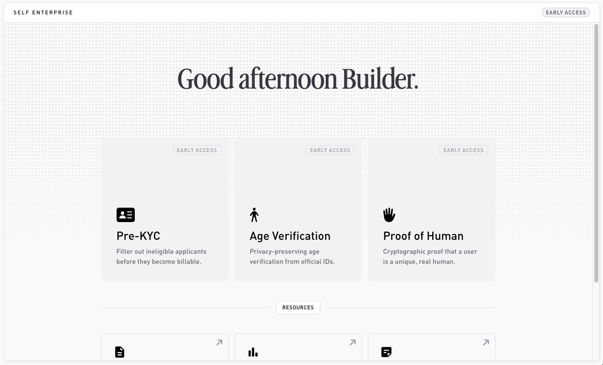
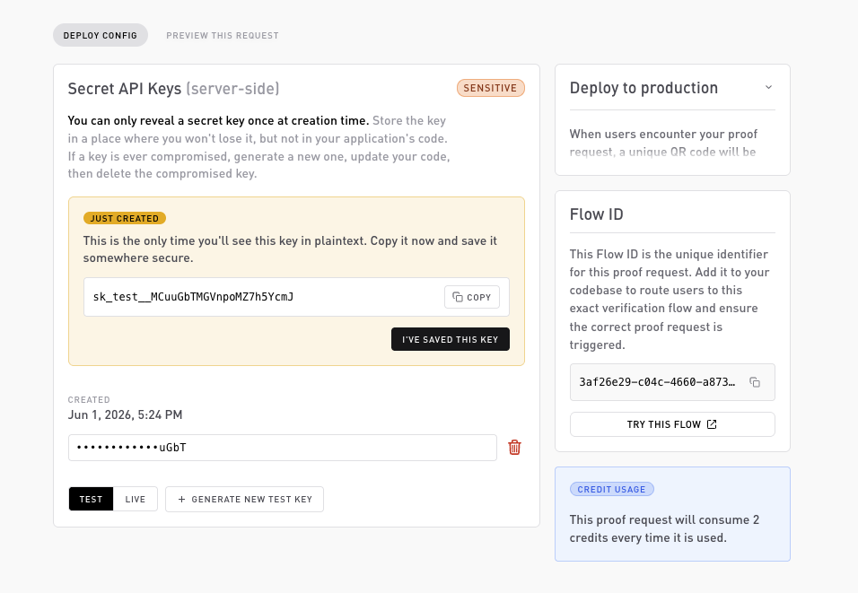

# Quickstart

End-to-end: from sign-up to a verified user, in about ten minutes.

## Prerequisites

* A Self.xyz dashboard account ([sign up](https://dashboard.self.xyz)).
* Node 18+ (for the SDK).
* A way to receive a webhook locally, [ngrok](https://ngrok.com), Cloudflare Tunnel, or any public HTTPS endpoint.

## 1. Create your organization

After sign-up you'll be prompted to create an organization. An org owns flows, API keys, webhook subscriptions, and the billing relationship. You can invite teammates from **Settings → People** once it's set up.

## 2. Create a flow



The dashboard home shows a card for each of the three products. Pick the one you want to verify:

* **Pre KYC**: document plus optional age, country rules, and OFAC.
* **Age Verification**: an age threshold (for example 18 or 21).
* **Proof of Human**: unique humanity for sybil resistance, no extra rules.

Open a product and click **New config** to create a configuration. For this walkthrough, **Age Verification** is the quickest. A configuration has three parts:

* **Rules**: what the user must prove. For Age Verification, a minimum age.
* **Documents**: which credentials are acceptable (passport, Aadhaar, KYC attestation).
* **Settings**: success and failure redirect URLs, display name, branding.

Fill them in, then publish. Your configuration now has a published `flowId`. Copy it.


**One active config at a time.** A product keeps a single active configuration. To create a new one, archive the current config under **Settings** first.


> **Test vs. live:** a configuration published in your test environment only accepts mock passports and never bills credits. See [Test vs. live](../flows/test-vs-live.md).

## 3. Create an API key

**Settings → API keys → Create key**. Choose `test` while you're integrating. The key (`sk_test_...`) is shown once, store it as `SELF_API_KEY` in your backend's secret manager.



## 4. Install the SDK

```bash
npm install @selfxyz/enterprise-sdk
```

## 5. Create a verification session

```ts
import { SelfClient } from '@selfxyz/enterprise-sdk';

const self = new SelfClient({ apiKey: process.env.SELF_API_KEY! });

const session = await self.sessions.create({
  flowId: '<paste flowId from step 2>',
  externalUuid: 'user_42',           // your stable identifier for the user.
});

console.log(session.verificationUrl);  // hand this to the user.
```

The user opens `verificationUrl` in their Self app, produces a proof, and the app submits it back to us.

## 6. Subscribe to webhooks

**Settings → Webhooks → Add endpoint**. Paste your public URL (e.g. `https://<your-tunnel>/webhooks/self`) and subscribe to `verification.completed`.

The dashboard returns a signing secret (`whsec_...`). Store it as `SELF_WEBHOOK_SECRET`.

## 7. Verify webhook deliveries

```ts
import express from 'express';
import { SelfWebhooks } from '@selfxyz/enterprise-sdk';

const app = express();

app.post(
  '/webhooks/self',
  express.raw({ type: 'application/json' }),  // raw body is required for signature verification.
  (req, res) => {
    try {
      const event = SelfWebhooks.verify(
        req.body,                                            // Buffer.
        req.headers as Record<string, string>,
        process.env.SELF_WEBHOOK_SECRET!,
      );

      if (event.type === 'verification.completed') {
        // event.verification_id, event.external_uuid, event.proof_attributes.
        console.log('verified:', event);
      }

      res.status(200).end();
    } catch (err) {
      res.status(400).end();
    }
  },
);
```

## 8. Test the loop

Open the `verificationUrl` from step 5, run through with a mock passport, and watch your webhook handler fire. The dashboard's **Activity log** tab on the flow shows the verification end-to-end.

## What's next

* [How verification works](how-it-works.md): the zero-knowledge model behind that webhook.
* [Configure a product](../dashboard/configure-a-product.md): go beyond defaults.
* [Event catalog](../webhooks/events.md): every webhook type and its payload.
* [SDK reference](../sdk/nodejs.md): every SDK method, with types.
* [Error handling](../sdk/error-handling.md): what each error means and how to handle it.
